

<h1 align="center">AnMaCha Cast</h1>
<h3 align="center">Dein Radio. Dein Studio. AnMaCha Cast.</h3>

Automation · Live Studio · Musikverwaltung · Sendeplanung · Streaming · MusicHub

Automatisieren, live senden und mehrere Stationen verwalten – mit einer Oberfläche für den echten Radiobetrieb.

<a href="https://ricorewioriginal-collab.github.io/anmacha_cast/"><strong>🌐 AnMaCha-Cast-Projektseite</strong></a> · <a href="CHANGELOG.md"><strong>📝 Was ist neu?</strong></a>

<a href="#-anmacha-cast">Über AnMaCha Cast</a> · <a href="#-oberfläche--screenshots">Screenshots</a> · <a href="#-live-demo">Demo</a> · <a href="#️-anmacha-cast-herunterladen">Downloads</a> · <a href="#-versionshistorie--änderungen">Versionen</a> · <a href="#-projektstand">Projektstand</a> · <a href="#-entwickeln--mitwirken">Entwickeln</a> · <a href="#-dokumentation">Dokumentation</a> · <a href="#️-lizenz--kommerzielle-nutzung">Lizenz</a>

---

## 🎛️ AnMaCha Cast

AnMaCha Cast ist eine eigenständige Radio-Automation und Live-Broadcast-Plattform. Sie verbindet klassische Radioautomation mit einem modernen Studio, mehreren Sendern, Mediathek, Playlists, Sendeplanung, Streaming, Recorder, externen Providern und dem entstehenden senderübergreifenden **MusicHub**.

> **AnMaCha Cast ist für echte Radio-Workflows gedacht:** vom Live-Studio über automatisiertes Playout bis zur gemeinsamen Medienverwaltung mehrerer Stationen.

### ✨ Kernbereiche

| 🎚️ Studio & Playout | 🎵 Medien & Planung | 📡 Betrieb & Integration |
|---|---|---|
| Live Studio, Queue, Decks & Cardwall | Mediathek, Playlists & Sendeplanung | Streaming & externe Provider |
| 24/7 Automation & Playout | MusicHub & Medienfreigaben | Zusatz-Streams & Ausspielwege |
| Recorder & Live-Steuerung | Nextcloud-/Storage-Anbindungen | Benutzer, Rollen & Rechte |
| Mehrere Sender | Senderbezogene Berechtigungen | Windows, Android, Linux/Server & Docker |

---

## 📸 Oberfläche & Screenshots

<strong>AnMaCha Cast in Bewegung</strong> Die Vorschau wird vom bestehenden Screenshot-Workflow aktualisiert. Für Details einfach ein Bild anklicken.

<a href="docs/screenshots/slideshow.gif">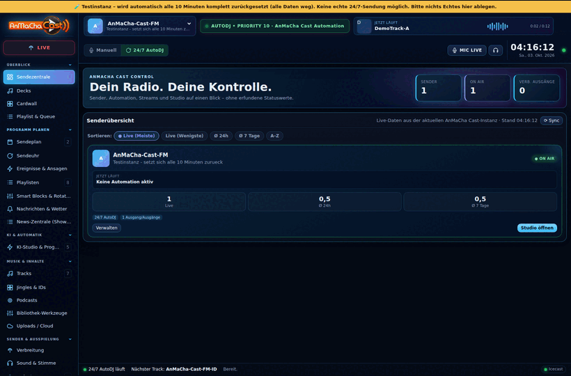</a>

<table><tr><td align="center" width="33%"><a href="docs/screenshots/view-dashboard.png">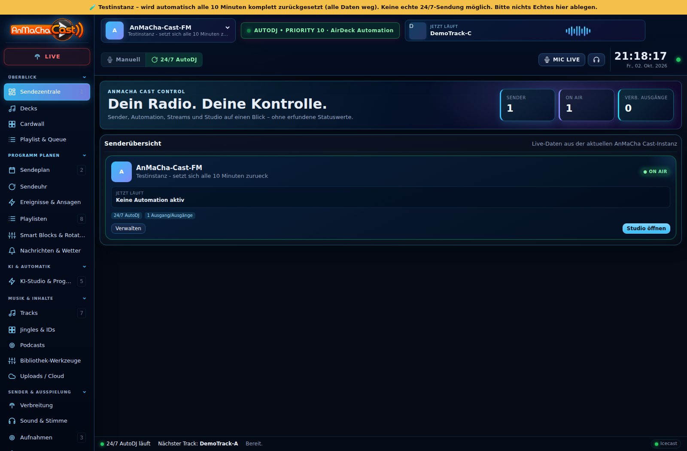</a> <strong>🏠 Dashboard</strong></td><td align="center" width="33%"><a href="docs/screenshots/view-studio.png">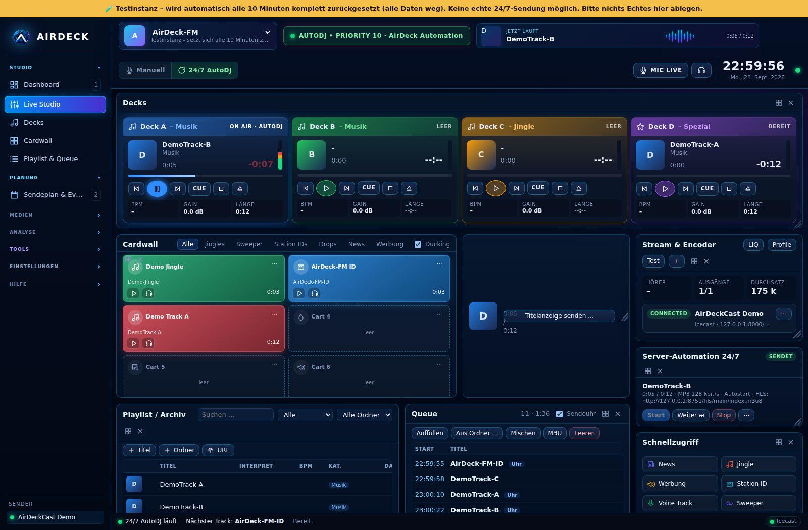</a> <strong>🎚️ Studio</strong></td><td align="center" width="33%"><a href="docs/screenshots/view-mediathek.png">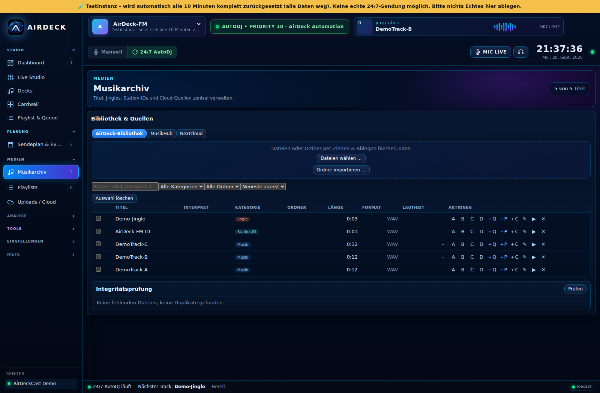</a> <strong>🎵 Mediathek</strong></td></tr></table>

<strong>🖼️ Weitere Screenshots anzeigen</strong>
 <table><tr><td align="center"><a href="docs/screenshots/view-planning.png">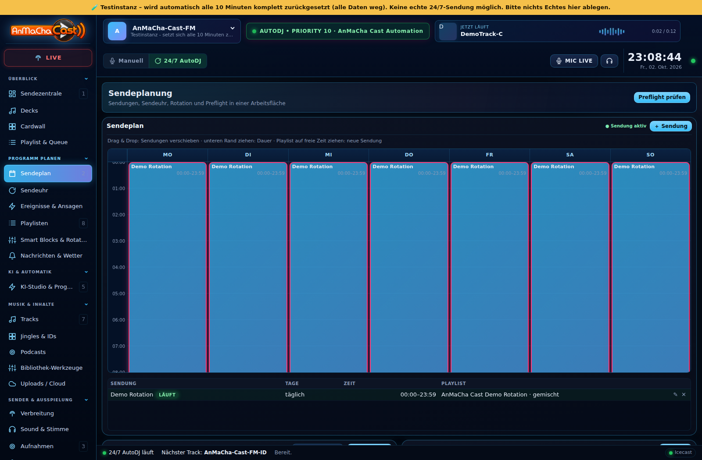</a> Sendeplanung</td><td align="center"><a href="docs/screenshots/view-playlists.png">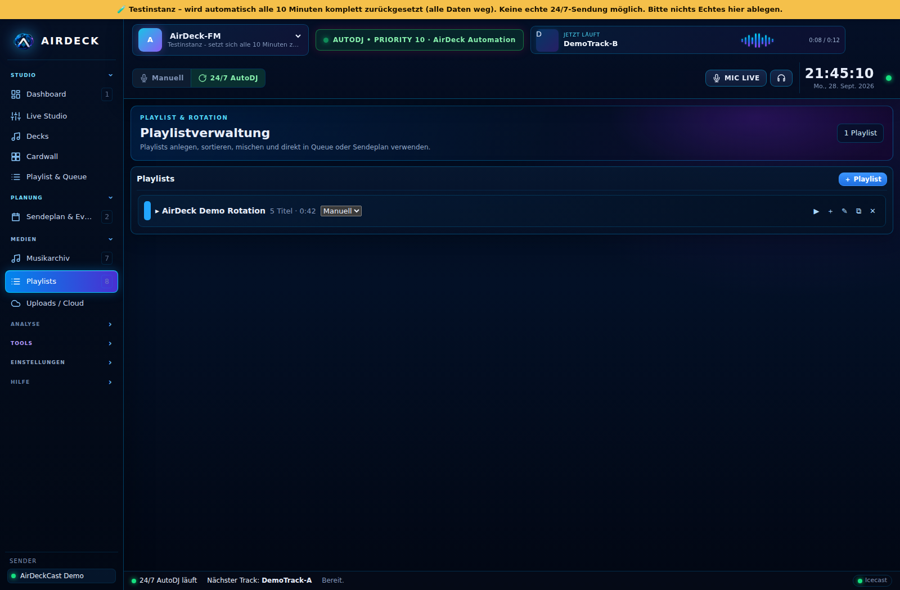</a> Playlists</td><td align="center"><a href="docs/screenshots/view-recorder.png">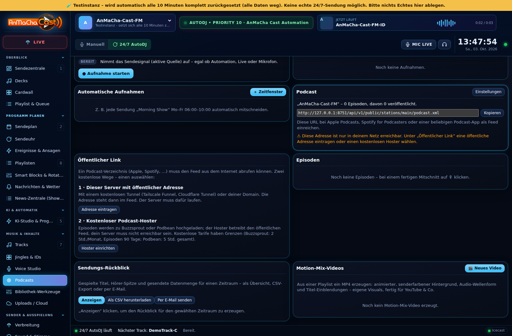</a> Recorder</td></tr><tr><td align="center"><a href="docs/screenshots/view-nextcloud.png">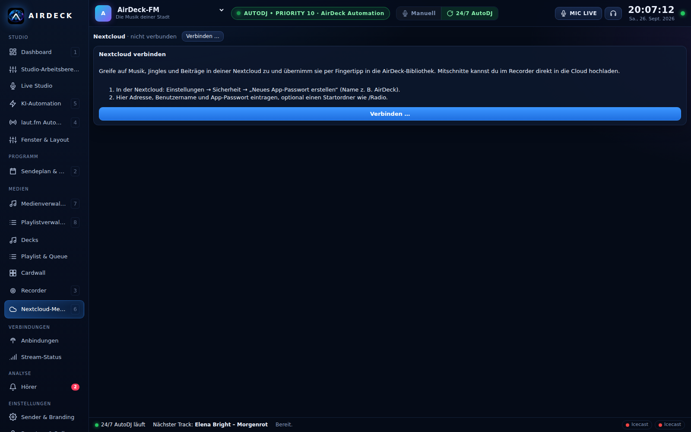</a> Nextcloud</td><td align="center"><a href="docs/screenshots/view-users.png">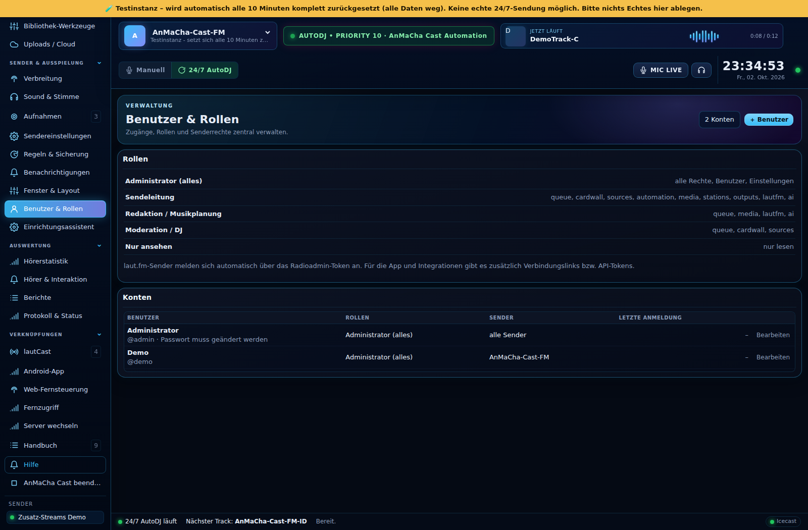</a> Benutzer & Rechte</td><td align="center"><a href="docs/screenshots/handy-sender.png">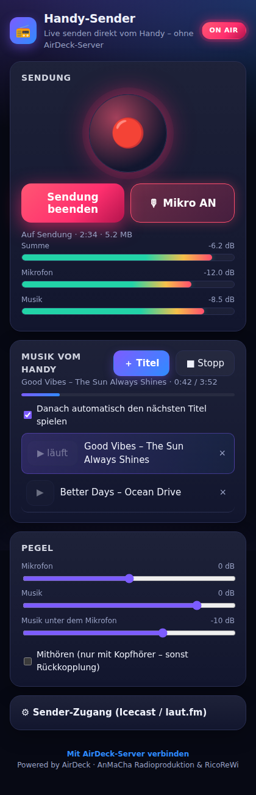</a> Mobile Ansicht</td></tr></table>

<a href="docs/screenshots/"><strong>Alle Screenshot-Dateien →</strong></a> · <a href="https://ricorewioriginal-collab.github.io/anmacha_cast/#screenshots"><strong>Interaktive Galerie →</strong></a>

---

## 🚀 Live-Demo

AnMaCha Cast kann direkt im Browser ausprobiert werden.

**Demo-Zugang:** `demo` / `anmachacast-demo`

> Die Instanz dient ausschließlich zum Testen. Bitte dort keine produktiven oder vertraulichen Daten hinterlegen.

---

## ⬇️ AnMaCha Cast herunterladen

<a href="CHANGELOG.md"><strong>📝 Changelog & Versionsvergleich</strong></a> · <a href="https://github.com/ricorewioriginal-collab/anmacha_cast/releases"><strong>📦 Alle Releases</strong></a>

<a href="https://github.com/ricorewioriginal-collab/anmacha_cast/releases/latest/download/AnMaCha-Cast-Setup.exe">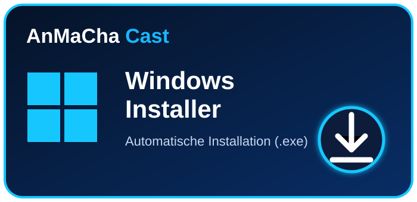</a><a href="https://github.com/ricorewioriginal-collab/anmacha_cast/releases/latest/download/AnMaCha-Cast-Windows-Portable.zip">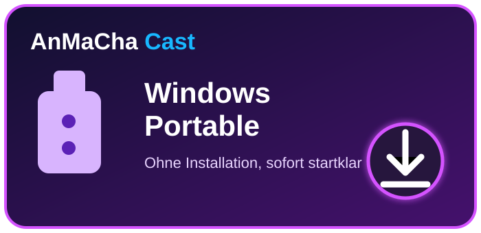</a>

<a href="https://github.com/ricorewioriginal-collab/anmacha_cast/releases/latest/download/AnMaCha-Cast-Android.apk">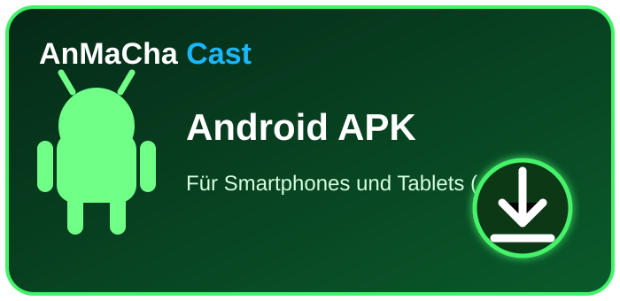</a><a href="https://github.com/ricorewioriginal-collab/anmacha_cast/releases/latest/download/AnMaCha-Cast-Linux.deb">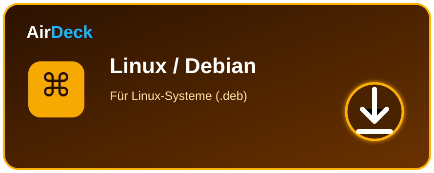</a>

> Die Download-Links zeigen automatisch auf die Dateien des jeweils neuesten veröffentlichten GitHub-Releases (`AnMaCha-Cast-*`, siehe `docs/REBRANDING_ANMACHA_CAST.md` Phase 8). Ältere Releases vor dieser Umstellung tragen noch den Dateinamen `AnMaCha-Cast-*`.

---

## 📝 Versionshistorie & Änderungen

AnMaCha Cast führt ein **automatisch gepflegtes Changelog**. Bei neuen offiziellen Veröffentlichungen werden Release, Datum und der Vergleich zur vorherigen Version ergänzt. So lässt sich nachvollziehen, was sich zwischen zwei veröffentlichten AnMaCha-Cast-Versionen geändert hat.

<a href="CHANGELOG.md"><strong>📝 Vollständigen Changelog öffnen →</strong></a> <a href="https://github.com/ricorewioriginal-collab/anmacha_cast/compare/build-323...v0.4.1">Aktuell: Build 323 mit Aurora v0.4.1 vergleichen</a>

---

## 📊 Projektstand

AnMaCha Cast befindet sich in aktiver Entwicklung. Funktionen, Oberfläche, Plattformpakete und Dokumentation werden laufend erweitert und getestet.

- **Status:** Beta
- **Build:** GitHub Actions
- **Release:** [immer die aktuelle veröffentlichte Version](https://github.com/ricorewioriginal-collab/anmacha_cast/releases/latest)
- **Änderungen:** [automatisch gepflegter Changelog](CHANGELOG.md)
- **Plattformen:** Windows · Android · Linux/Server · Docker
- **Live-Demo:** [anmachacast-demo.ricorewi-radio.de](https://anmachacast-demo.ricorewi-radio.de)

---

## 🧑‍💻 Entwickeln & Mitwirken

AnMaCha Cast kann von Entwicklern geklont und in einer eigenen Entwicklungsumgebung weiterentwickelt werden. Änderungen sollen nachvollziehbar, testbar und sicher bleiben. Vor einer offiziellen Übernahme oder Veröffentlichung werden Anpassungen geprüft und freigegeben.

Bitte vor Beiträgen **[CONTRIBUTING.md](CONTRIBUTING.md)** lesen. Für KI-unterstützte Entwicklung gelten zusätzlich die Hinweise in **[AI_HANDOUT.md](AI_HANDOUT.md)**: KI-generierte bzw. wesentlich KI-unterstützte Änderungen transparent kennzeichnen, Funktionen menschlich prüfen, Bugs beheben und Sicherheitslücken nicht ungeprüft übernehmen.

---

## 📚 Dokumentation

- **[AnMaCha-Cast-Projektdokumentation](https://ricorewioriginal-collab.github.io/anmacha_cast/docs.html)** – README, Changelog, Wiki und Lizenz direkt auf der Projektseite
- **[CHANGELOG.md](CHANGELOG.md)** – Versionshistorie und Vergleich veröffentlichter Versionen
- **[GitHub Wiki](https://github.com/ricorewioriginal-collab/anmacha_cast/wiki)** – ausführliche Projekt- und Entwicklerdokumentation
- **[Installation](docs/INSTALLATION.md)** – Installation und Plattformhinweise
- **[Docker](docs/DOCKER.md)** – Server-/Containerbetrieb
- **[CONTRIBUTING.md](CONTRIBUTING.md)** – Regeln für Beiträge und Freigaben
- **[AI_HANDOUT.md](AI_HANDOUT.md)** – Empfehlungen für KI-unterstützte Entwicklung

---

## ⚖️ Lizenz & kommerzielle Nutzung

Die normale AnMaCha-Cast-Version soll kostenlos nutzbar bleiben. Der Quellcode ist verfügbar, aber AnMaCha Cast ist **nicht als klassische Open-Source-Lizenz zur uneingeschränkten kommerziellen Weiterverwertung gedacht**. Maßgeblich sind ausschließlich die Bedingungen in **[LICENSE](LICENSE)**.

Wer AnMaCha Cast oder einen Fork kommerziell hosten, als kostenpflichtigen Dienst oder als eigenes Abomodell anbieten möchte, muss die dort beschriebenen Lizenzbedingungen beachten und gegebenenfalls eine kommerzielle Vereinbarung abschließen.

---

## 📻 AnMaCha Cast im Einsatz

AnMaCha Cast wird teilweise im Umfeld von **RicoReWi Radio / AnMaCha** eingesetzt. Musikstreams und weitere Radioprojekte findest du unter **[ricorewi-radio.de](https://www.ricorewi-radio.de/)**.

Für ausgewählte Streams wird **laut.fm** eingesetzt. laut.fm übernimmt im Rahmen seines Angebots für die dort betriebenen Sender die Abwicklung mit GEMA und GVL; für den konkreten Nutzungsfall gelten die jeweils aktuellen Bedingungen des Anbieters.

---

<strong>AnMaCha Cast</strong> Dein Radio. Dein Studio. AnMaCha Cast.

