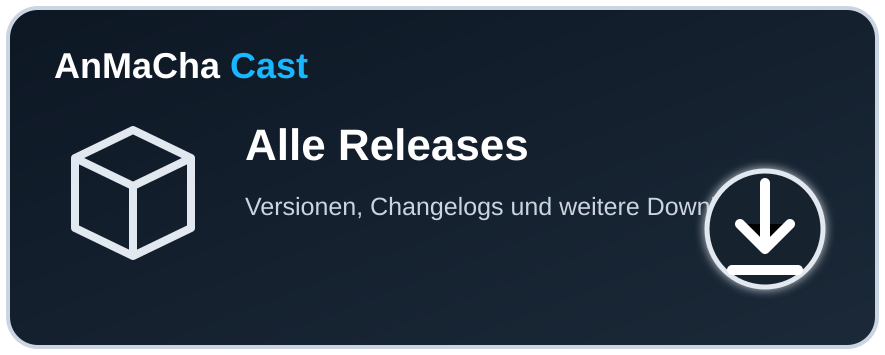

# AirDeck – Radio Automation & Live Broadcast

<p align="center">
  
</p>

<h3 align="center">Radio Automation · Live Studio · Streaming · MusicHub</h3>

<p align="center">
  Eine moderne Broadcast-Plattform für 24/7-Automation, Live-Radio, Sendeplanung,<br>
  Medienverwaltung, Streaming-Ausgänge und mehrere Sender.
</p>

<table>
<tr>
<td align="center"><a href="https://github.com/ricorewioriginal-collab/airdeck/actions/workflows/build.yml?query=branch%3AAirDeck-Radio-Automation-%26-Broadcast"></a></td>
<td align="center"></td>
<td align="center"></td>
<td align="center"><a href="LICENSE"></a></td>
</tr>
</table>

<p align="center">
  <a href="https://airdeck-demo.ricorewi-radio.de"></a>
  <a href="https://github.com/ricorewioriginal-collab/airdeck/releases"></a>
</p>

<p align="center">
  <strong>Ein Projekt von RicoReWi / RicoReWi Music & Media.</strong>
</p>

---

## 🎛️ AirDeck

AirDeck ist eine eigenständige Radio-Automation und Live-Broadcast-Plattform. Das Projekt verbindet klassische Radioautomation mit einem modernen Studio, mehreren Sendern, Mediathek, Playlists, Sendeplanung, Streaming, Recorder, externen Providern und dem entstehenden senderübergreifenden **MusicHub**.

<p align="center">
  
</p>

### ✨ Schwerpunkte

- 24/7 Radio-Automation und Playout
- Live Studio mit Queue, Decks, Cardwall und Live-Bedienung
- Medien-, Playlist- und Sendeplanverwaltung
- mehrere Sender und senderbezogene Berechtigungen
- Streaming- und Provider-Anbindungen
- AirDeckCast und lokale/externe Ausspielwege
- MusicHub für kontrollierte senderübergreifende Medienfreigaben
- Nextcloud und weitere Cloud-/Storage-Anbindungen
- Benutzer, Rollen und Rechte
- Windows-, Android-, Linux-/Server- und Docker-Ziele
- REST-/Event-basierte Integrationen

---

## 📸 Studio & Oberfläche

| Dashboard | Live Studio | Sendeplan |
|---|---|---|
| [](docs/screenshots/view-dashboard.png) | [](docs/screenshots/view-studio.png) | [](docs/screenshots/view-planning.png) |

| Mediathek | Playlists | Recorder |
|---|---|---|
| [](docs/screenshots/view-mediathek.png) | [](docs/screenshots/view-playlists.png) | [](docs/screenshots/view-recorder.png) |

<p align="center"><a href="docs/screenshots/"><strong>Weitere AirDeck-Screenshots ansehen →</strong></a></p>

---

## 🚀 Live-Demo

AirDeck kann direkt im Browser ausprobiert werden.

<p align="center">
  <a href="https://airdeck-demo.ricorewi-radio.de"></a>
</p>

**Demo-Zugang:** `demo` / `airdeck-demo`

Die Instanz dient ausschließlich zum Testen. Bitte dort keine produktiven oder vertraulichen Daten hinterlegen.

---

## ⬇️ AirDeck herunterladen

Aktuell veröffentlichter Beta-Prüfstand: **AirDeck – Build 323 (Beta)**.

<table>
<tr>
<td align="center" width="33%"><a href="https://github.com/ricorewioriginal-collab/airdeck/releases/download/build-323/AirDeck-Setup.exe"></a></td>
<td align="center" width="33%"><a href="https://github.com/ricorewioriginal-collab/airdeck/releases/download/build-323/AirDeck-Windows-Portable.zip"></a></td>
<td align="center" width="33%"><a href="https://github.com/ricorewioriginal-collab/airdeck/releases/download/build-323/AirDeck-Android.apk"></a></td>
</tr>
<tr>
<td align="center" colspan="2"><a href="https://github.com/ricorewioriginal-collab/airdeck/releases/download/build-323/AirDeck-Linux.deb"></a></td>
<td align="center"><a href="https://github.com/ricorewioriginal-collab/airdeck/releases"></a></td>
</tr>
</table>

> **Beta-Hinweis:** Die Downloads sind Entwicklungs-/Beta-Builds. Vor einem produktiven Einsatz Daten sichern und die benötigten Funktionen selbst prüfen. Die Android-APK des aktuellen Build 323 verwendet eine Debug-Signatur.

---

## 🚦 Projektstand

AirDeck wird aktiv entwickelt. Vorhandene Kernbereiche umfassen unter anderem Automation, Live Studio, Mediathek, Playlists, Sendeplanung, Streaming, Benutzer-/Rechtesystem und mehrere Zielplattformen.

Aktuell besonders im Ausbau bzw. in der Härtung sind:

- MusicHub und senderübergreifende Medienfreigaben
- Nextcloud-/Cloud-Anbindungen
- UI/UX auf Basis der AirDeck-Zielbilder
- Windows Installer und First-Run-Ersteinrichtung
- plattformübergreifende Packaging-/Build-Prozesse
- Long-Run-, Recovery- und Release-Härtung
- Sicherheits- und Berechtigungsprüfungen

> Ein implementiertes Feature, ein bestandener automatisierter Test und eine menschlich bzw. live geprüfte Funktion sind unterschiedliche Qualitätsstufen. Der tatsächliche Entwicklungsstand ergibt sich aus aktuellem Code, Tests, Issues/PRs und veröffentlichten Releases.

---

## 📻 AirDeck im echten Radio-Umfeld

AirDeck wird nicht nur als Entwicklungsprojekt aufgebaut, sondern in Teilen auch im Radio-Umfeld von **RicoReWi Radio** eingesetzt und erprobt.

<p align="center">
  <a href="https://www.ricorewi-radio.de/"></a>
</p>

Auf **ricorewi-radio.de** findest du unter anderem die **AnMaCha- und RicoReWi-Musicstreams**. Teile der AirDeck-Entwicklung können so auch in realen Radio-Workflows erprobt werden.

### ❤️ Webradio mit laut.fm

Die Radioangebote nutzen **laut.fm** als Radioplattform. laut.fm ermöglicht den Betrieb eigener Internetradiostationen und übernimmt nach eigenen Angaben für dort betriebene Stationen die anfallenden GEMA- und GVL-Gebühren sowie Streamingkosten; das Angebot wird unter anderem über Werbung finanziert. Für die konkrete Nutzung gelten die Bedingungen und Musikregeln von laut.fm.

<p align="center">
  <a href="https://laut.fm/"></a>
</p>

Wer selbst mit Webradio anfangen möchte, kann sich laut.fm ansehen. Die Plattform bietet eigene Radiostationen, Musikpool, Playlisten, Automation und Live-Radio. AirDeck verfolgt ein eigenständiges Softwarekonzept und kann für Workflows rund um externe Radioplattformen weiterentwickelt und eingesetzt werden.

> **Transparenz:** AirDeck ist ein eigenständiges Projekt von RicoReWi / RicoReWi Music & Media. Die Nennung von laut.fm beschreibt die eingesetzte Radioplattform und bedeutet nicht, dass AirDeck ein Produkt der LAUT AG ist oder von ihr herausgegeben wird.

---

## ⚡ Entwickeln & mitwirken

```bash
git clone https://github.com/ricorewioriginal-collab/airdeck.git
cd airdeck
git checkout 'AirDeck-Radio-Automation-&-Broadcast'
npm ci
npm run check
npm start
```

Entwickler können AirDeck forken oder klonen und eigenständig weiterentwickeln.

```text
Fork / Clone
   ↓
Feature-Branch
   ↓
entwickeln + testen
   ↓
Pull Request
   ↓
CI + menschliches Review
   ↓
Maintainer-Freigabe
   ↓
offizieller Build / versioniertes Release
```

Ein Pull Request oder Community-Build wird nicht automatisch zum offiziellen AirDeck-Release.

**Für Entwickler:** [`CONTRIBUTING.md`](CONTRIBUTING.md) · [`SECURITY.md`](SECURITY.md) · [`SUPPORT.md`](SUPPORT.md)

---

## 🤖 KI-unterstützte Entwicklung

AirDeck darf mit Coding-Assistenten und KI-Agenten weiterentwickelt werden. Es gibt keine fest reservierten Agenten oder Anbieter.

[`AI_HANDOVER.md`](AI_HANDOVER.md) ist ein allgemeiner Leitfaden für verantwortungsvolle KI-unterstützte Entwicklung und **keine Aufgaben- oder Reservierungsliste**.

Dabei gelten insbesondere:

- KI-Code menschlich prüfen
- Funktionen real testen
- Bugs an der Ursache beheben
- Sicherheitslücken schließen und anschließend testen
- keine Fake-Daten oder simulierten Erfolgszustände als echte Funktion ausgeben
- Secrets schützen
- wesentliche KI-Unterstützung transparent kennzeichnen

---

## 📚 Dokumentation

| Bereich | Zweck |
|---|---|
| `README.md` | Projektübersicht, Demo, Screenshots und Downloads |
| GitHub Wiki | Benutzerhandbuch |
| `docs/architecture/` | verbindliche technische Architektur |
| `CONTRIBUTING.md` | Entwicklung und Beiträge |
| `SECURITY.md` | Sicherheitsmeldungen |
| `SUPPORT.md` | Supportwege |
| `AI_HANDOVER.md` | KI-Entwicklungsleitfaden |
| `CHANGELOG.md` | offizielle Versionshistorie |
| Issues / Pull Requests | Bugs, Features, Änderungen und Reviews |
| GitHub Releases | veröffentlichte Builds |

**Architektur:** [`ARCHITECTURE.md`](docs/architecture/ARCHITECTURE.md) · [`DATABASE.md`](docs/architecture/DATABASE.md) · [`SECURITY.md`](docs/architecture/SECURITY.md) · [`NETWORK.md`](docs/architecture/NETWORK.md) · [`STORAGE.md`](docs/architecture/STORAGE.md) · [`DEPLOYMENT.md`](docs/architecture/DEPLOYMENT.md)

<p align="center">
  <a href="https://github.com/ricorewioriginal-collab/airdeck/wiki"></a>
</p>

---

## ⚖️ Lizenz & kommerzielle Nutzung

AirDeck soll in seiner normalen Version kostenlos nutzbar bleiben.

Die projektspezifische **AirDeck Source Available License (ASAL) v1.0** erlaubt unter ihren Bedingungen insbesondere das Ansehen, Klonen, Forken, Verändern und den eigenen Betrieb von AirDeck.

Ein Radiosender darf AirDeck für den eigenen Sendebetrieb verwenden; normale Einnahmen des Radiosenders lösen nicht allein dadurch eine AirDeck-Umsatzbeteiligung aus.

Wer dagegen **AirDeck oder einen AirDeck-Fork selbst als kostenpflichtiges Hosting, SaaS, Abo, Reseller- oder White-Label-Angebot für Dritte monetarisiert**, benötigt vorher eine gesonderte Commercial Hosting License.

**Recht & Projektregeln:** [`LICENSE`](LICENSE) · [`COMMERCIAL.md`](COMMERCIAL.md) · [`BRANDING.md`](BRANDING.md) · [`CODE_OF_CONDUCT.md`](CODE_OF_CONDUCT.md)

> **Based on AirDeck – originally created by Ricardo Ramon Reimer Wiebe / RicoReWi.**

Die Lizenz ist Source Available und wird nicht als OSI-zertifizierte Open-Source-Lizenz dargestellt. Der aktuelle Lizenztext ist als Entwurf gekennzeichnet und sollte vor kommerzieller Nutzung juristisch geprüft werden.

---

<p align="center">
  
</p>

<h3 align="center">AirDeck – Radio Automation & Live Broadcast</h3>
<p align="center">Originally created by <strong>Ricardo Ramon Reimer Wiebe / RicoReWi</strong></p>
