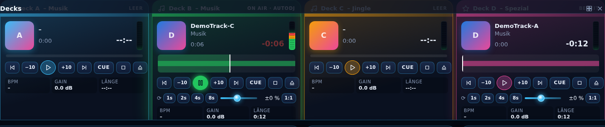
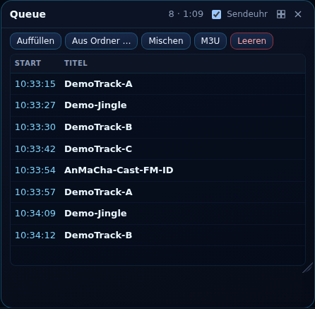
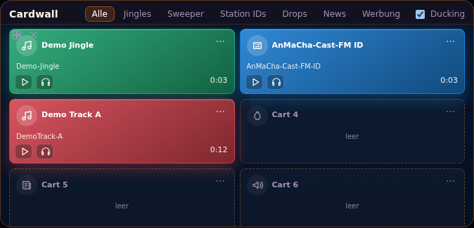
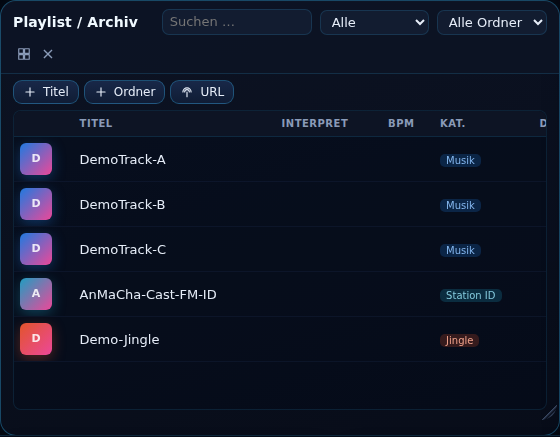
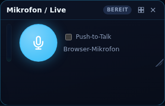
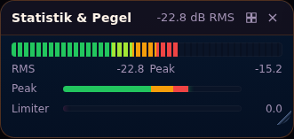
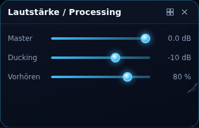
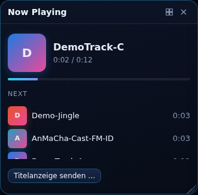

<p align="center"></p>

<h1 align="center">AirDeck</h1>
<h3 align="center">Dein Radio. Dein Studio. Dein AirDeck.</h3>
<p align="center">Automation · Live Studio · Musikverwaltung · Sendeplanung · Streaming · MusicHub</p>
<p align="center">Automatisieren, live senden und mehrere Stationen verwalten – mit einer Oberfläche für den echten Radiobetrieb.</p>

<table><tr><td align="center"><a href="https://github.com/ricorewioriginal-collab/airdeck/actions/workflows/build.yml?query=branch%3AAirDeck-Radio-Automation-%26-Broadcast"></a></td><td align="center"></td><td align="center"></td><td align="center"><a href="LICENSE"></a></td></tr></table>

<table><tr><td align="center" width="33%"><a href="https://airdeck-demo.ricorewi-radio.de"></a></td><td align="center" width="33%"><a href="https://github.com/ricorewioriginal-collab/airdeck/releases"></a></td><td align="center" width="33%"><a href="https://ricorewioriginal-collab.github.io/airdeck/"><strong>🌐 AirDeck Projektseite</strong></a></td></tr></table>

<p align="center"><a href="#-airdeck">Über AirDeck</a> · <a href="#-oberfläche--screenshots">Screenshots</a> · <a href="#-live-demo">Demo</a> · <a href="#️-airdeck-herunterladen">Downloads</a> · <a href="#-projektstand">Projektstand</a> · <a href="#-entwickeln--mitwirken">Entwickeln</a> · <a href="#-dokumentation">Dokumentation</a> · <a href="#️-lizenz--kommerzielle-nutzung">Lizenz</a></p>

---

## 🎛️ AirDeck

AirDeck ist eine eigenständige Radio-Automation und Live-Broadcast-Plattform. Sie verbindet klassische Radioautomation mit einem modernen Studio, mehreren Sendern, Mediathek, Playlists, Sendeplanung, Streaming, Recorder, externen Providern und dem entstehenden senderübergreifenden **MusicHub**.

> **AirDeck ist für echte Radio-Workflows gedacht:** vom Live-Studio über automatisiertes Playout bis zur gemeinsamen Medienverwaltung mehrerer Stationen.

### ✨ Kernbereiche

| 🎚️ Studio & Playout | 🎵 Medien & Planung | 📡 Betrieb & Integration |
|---|---|---|
| Live Studio, Queue, Decks & Cardwall | Mediathek, Playlists & Sendeplanung | Streaming & externe Provider |
| 24/7 Automation & Playout | MusicHub & Medienfreigaben | AirDeckCast & Ausspielwege |
| Recorder & Live-Steuerung | Nextcloud-/Storage-Anbindungen | Benutzer, Rollen & Rechte |
| Mehrere Sender | Senderbezogene Berechtigungen | Windows, Android, Linux/Server & Docker |

---

## 📸 Oberfläche & Screenshots

<p align="center"><strong>Kompakte Vorschau – Screenshot anklicken, um die Originalansicht groß zu öffnen.</strong></p>

<table>
<tr><td align="center" width="33%"><a href="docs/screenshots/panel-decks.png"></a><br><strong>🎚️ Decks</strong></td><td align="center" width="33%"><a href="docs/screenshots/panel-queue.png"></a><br><strong>▶️ Queue & Playout</strong></td><td align="center" width="33%"><a href="docs/screenshots/panel-carts.png"></a><br><strong>🔊 Cartwall</strong></td></tr>
<tr><td align="center"><a href="docs/screenshots/panel-lib.png"></a><br><strong>🎵 Musikbibliothek</strong></td><td align="center"><a href="docs/screenshots/panel-live.png"></a><br><strong>🔴 Live-Betrieb</strong></td><td align="center"><a href="docs/screenshots/handy-sender.png"></a><br><strong>📱 Mobile Ansicht</strong></td></tr>
</table>

<details><summary><strong>🖼️ Weitere UI-Bereiche anzeigen</strong></summary><br>
<table><tr><td align="center"><a href="docs/screenshots/panel-meters.png"></a><br>Audio Meter</td><td align="center"><a href="docs/screenshots/panel-processing.png"></a><br>Processing</td><td align="center"><a href="docs/screenshots/panel-np.png"></a><br>Now Playing</td></tr></table>
</details>

<p align="center"><a href="docs/screenshots/"><strong>Alle Screenshot-Dateien →</strong></a> · <a href="https://ricorewioriginal-collab.github.io/airdeck/#screenshots"><strong>Interaktive Galerie auf der AirDeck-Seite →</strong></a></p>

---

## 🚀 Live-Demo

AirDeck kann direkt im Browser ausprobiert werden.

<p align="center"><a href="https://airdeck-demo.ricorewi-radio.de"></a></p>

**Demo-Zugang:** `demo` / `airdeck-demo`

> Die Instanz dient ausschließlich zum Testen. Bitte dort keine produktiven oder vertraulichen Daten hinterlegen.

Geplant ist ein serverseitiger Demo-Login-Endpunkt, der eine eingeschränkte Demo-Session erstellt, ohne Zugangsdaten in die URL zu schreiben.

---

## ⬇️ AirDeck herunterladen

**Aktueller Beta-Prüfstand: AirDeck – Build 323 (Beta)**

<table><tr><td align="center" width="33%"><a href="https://github.com/ricorewioriginal-collab/airdeck/releases/download/build-323/AirDeck-Setup.exe"></a></td><td align="center" width="33%"><a href="https://github.com/ricorewioriginal-collab/airdeck/releases/download/build-323/AirDeck-Windows-Portable.zip"></a></td><td align="center" width="33%"><a href="https://github.com/ricorewioriginal-collab/airdeck/releases/download/build-323/AirDeck-Android.apk"></a></td></tr><tr><td align="center" colspan="2"><a href="https://github.com/ricorewioriginal-collab/airdeck/releases/download/build-323/AirDeck-Linux.deb"></a></td><td align="center"><a href="https://github.com/ricorewioriginal-collab/airdeck/releases"></a></td></tr></table>

> ⚠️ **Beta:** Entwicklungs-/Beta-Builds vor produktivem Einsatz selbst prüfen und Daten sichern. Die Android-APK des aktuellen Build 323 verwendet eine Debug-Signatur.

---

## 🚦 Projektstand

AirDeck wird aktiv entwickelt. Vorhandene Kernbereiche umfassen Automation, Live Studio, Mediathek, Playlists, Sendeplanung, Streaming, Benutzer-/Rechtesystem und mehrere Zielplattformen.

| Bereich | Status / Fokus |
|---|---|
| 🎛️ Automation & Live Studio | Kernbereiche vorhanden, laufende Härtung |
| 🎵 MusicHub | Ausbau senderübergreifender Medienfreigaben |
| ☁️ Cloud | Nextcloud-/weitere Storage-Anbindungen im Ausbau |
| 🎨 UI/UX | laufende Umsetzung auf Basis der AirDeck-Zielbilder |
| 📦 Packaging | Windows Installer, First-Run und plattformübergreifende Builds |
| 🛡️ Qualität | Long-Run, Recovery, Releases, Sicherheit & Berechtigungen |

> Ein implementiertes Feature, ein bestandener automatisierter Test und eine menschlich bzw. live geprüfte Funktion sind unterschiedliche Qualitätsstufen. Maßgeblich sind aktueller Code, Tests, Issues/PRs und veröffentlichte Releases.

---

## 📻 Im echten Radio-Umfeld

AirDeck wird in Teilen im Radio-Umfeld von **RicoReWi Radio** eingesetzt und erprobt.

<p align="center"><a href="https://www.ricorewi-radio.de/"></a></p>

Auf **ricorewi-radio.de** laufen unter anderem die **AnMaCha- und RicoReWi-Musicstreams**. Dadurch können Teile der AirDeck-Entwicklung auch in realen Radio-Workflows erprobt werden.

### ❤️ Webradio mit laut.fm

Die Radioangebote nutzen **laut.fm** als Radioplattform. laut.fm übernimmt nach eigenen Angaben für dort betriebene Stationen die anfallenden GEMA- und GVL-Gebühren sowie Streamingkosten; maßgeblich sind die jeweils aktuellen Bedingungen und Musikregeln von laut.fm.

<p align="center"><a href="https://laut.fm/"></a></p>

> **Transparenz:** AirDeck ist ein eigenständiges Projekt von RicoReWi / RicoReWi Music & Media. Die Nennung von laut.fm beschreibt die eingesetzte Radioplattform und bedeutet keine Herausgabe oder Trägerschaft von AirDeck durch die LAUT AG.

---

## ⚡ Entwickeln & mitwirken

```bash
git clone https://github.com/ricorewioriginal-collab/airdeck.git
cd airdeck
git checkout 'AirDeck-Radio-Automation-&-Broadcast'
npm ci
npm run check
npm start
```

### 🔁 Entwicklungsweg

```text
Fork / Clone → Feature-Branch → entwickeln + testen → Pull Request
     → CI + menschliches Review → Maintainer-Freigabe → offizieller Build / Release
```

Entwickler können AirDeck forken oder klonen und eigenständig weiterentwickeln. Ein Pull Request oder Community-Build wird **nicht automatisch** zum offiziellen AirDeck-Release.

**Entwickler-Dokumente:** [`CONTRIBUTING.md`](CONTRIBUTING.md) · [`SECURITY.md`](SECURITY.md) · [`SUPPORT.md`](SUPPORT.md)

---

## 🤖 KI-unterstützte Entwicklung

Coding-Assistenten und KI-Agenten dürfen bei AirDeck unterstützen; es gibt keine fest reservierten Agenten oder Anbieter. [`AI_HANDOVER.md`](AI_HANDOVER.md) beschreibt Empfehlungen für einen verantwortungsvollen Einsatz.

**Grundsatz:** KI kann Fehler machen. KI-generierter oder KI-veränderter Code muss menschlich geprüft, real getestet und sicherheitsrelevant kontrolliert werden.

- Funktionen real testen statt Erfolg zu simulieren
- Bugs an ihrer Ursache beheben
- Sicherheitslücken schließen und Fixes erneut testen
- Secrets und Zugangsdaten schützen
- wesentliche KI-Unterstützung transparent kennzeichnen

---

## 📚 Dokumentation

| 📄 Bereich | Zweck |
|---|---|
| [`README.md`](README.md) | Projektübersicht, Demo, Screenshots & Downloads |
| [GitHub Wiki](https://github.com/ricorewioriginal-collab/airdeck/wiki) | Benutzerhandbuch |
| [`docs/architecture/`](docs/architecture/) | technische Architektur |
| [`CONTRIBUTING.md`](CONTRIBUTING.md) | Entwicklung & Beiträge |
| [`SECURITY.md`](SECURITY.md) | Sicherheitsmeldungen |
| [`SUPPORT.md`](SUPPORT.md) | Supportwege |
| [`AI_HANDOVER.md`](AI_HANDOVER.md) | KI-Entwicklungsleitfaden |
| [`CHANGELOG.md`](CHANGELOG.md) | Versionshistorie |
| [Issues](https://github.com/ricorewioriginal-collab/airdeck/issues) / Pull Requests | Bugs, Features, Änderungen & Reviews |
| [Releases](https://github.com/ricorewioriginal-collab/airdeck/releases) | veröffentlichte Builds |

**Architektur:** [`ARCHITECTURE.md`](docs/architecture/ARCHITECTURE.md) · [`DATABASE.md`](docs/architecture/DATABASE.md) · [`SECURITY.md`](docs/architecture/SECURITY.md) · [`NETWORK.md`](docs/architecture/NETWORK.md) · [`STORAGE.md`](docs/architecture/STORAGE.md) · [`DEPLOYMENT.md`](docs/architecture/DEPLOYMENT.md)

<p align="center"><a href="https://github.com/ricorewioriginal-collab/airdeck/wiki"></a></p>

---

## ⚖️ Lizenz & kommerzielle Nutzung

**Die normale AirDeck-Version soll kostenlos nutzbar bleiben.**

Die projektspezifische **AirDeck Source Available License (ASAL) v1.0** erlaubt unter ihren Bedingungen insbesondere das Ansehen, Klonen, Forken, Verändern und den eigenen Betrieb von AirDeck.

Ein Radiosender darf AirDeck für den eigenen Sendebetrieb verwenden; normale Einnahmen des Radiosenders lösen nicht allein dadurch eine AirDeck-Umsatzbeteiligung aus.

Wer **AirDeck oder einen AirDeck-Fork als kostenpflichtiges Hosting, SaaS, Abo, Reseller- oder White-Label-Angebot für Dritte monetarisiert**, benötigt vorher eine gesonderte Commercial Hosting License.

**Recht & Projektregeln:** [`LICENSE`](LICENSE) · [`COMMERCIAL.md`](COMMERCIAL.md) · [`BRANDING.md`](BRANDING.md) · [`CODE_OF_CONDUCT.md`](CODE_OF_CONDUCT.md)

> **Based on AirDeck – originally created by Ricardo Ramon Reimer Wiebe / RicoReWi.**

Die Lizenz ist Source Available und wird nicht als OSI-zertifizierte Open-Source-Lizenz dargestellt. Der aktuelle Lizenztext ist als Entwurf gekennzeichnet und sollte vor kommerzieller Nutzung juristisch geprüft werden.

---

<p align="center"></p>
<h3 align="center">AirDeck – Radio Automation & Live Broadcast</h3>
<p align="center"><strong>Originally created by Ricardo Ramon Reimer Wiebe / RicoReWi</strong><br>RicoReWi Music & Media</p>
<p align="center"><a href="https://ricorewioriginal-collab.github.io/airdeck/">Projektseite</a> · <a href="https://airdeck-demo.ricorewi-radio.de">Live-Demo</a> · <a href="https://github.com/ricorewioriginal-collab/airdeck/releases">Downloads</a> · <a href="https://github.com/ricorewioriginal-collab/airdeck/wiki">Wiki</a></p>